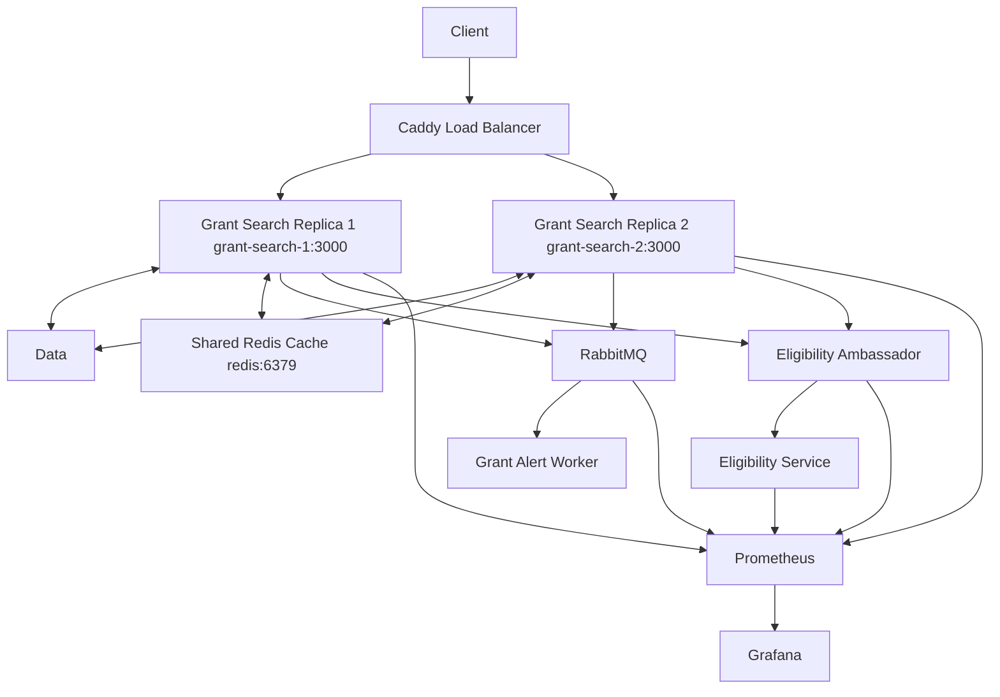

## grant-search-service:

- Acts as the shared API layer that accepts grant-search requests, retrieves matching opportunities, and coordinates requests to the eligibility and tracking services.  

## user-profile-service:

- Allows users to manage their own information and have quick access to tracked grants.  

## grant-tracking-service:

- Tracks grant milestones such as application opening, submission deadline ect and notifies users when that milestone is upcoming.  

## ## eligibility-analysis-service:

- Evaluates whether an organization appears eligible for a grant based on the organization's information and the grant's requirements.  

## grant-scraper-service:

- Collects grant opportunities from external sources and normalizes them to the systems internal format.  

## application-workflow-service:

- Manages applications, checklists, required documents, completion percent, and application status changes.  

## Diagram:

